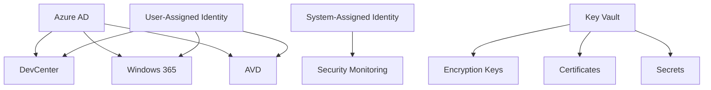

# Security Implementation Guide for DevFactory

## Overview

This guide provides step-by-step instructions for implementing comprehensive security measures across DevFactory deployments, including DevBox, Windows 365, and Azure Virtual Desktop (AVD) environments.

## Table of Contents

1. [Prerequisites](#prerequisites)
2. [Security Architecture](#security-architecture)
3. [Implementation Steps](#implementation-steps)
4. [Security Monitoring Setup](#security-monitoring-setup)
5. [Platform-Specific Security](#platform-specific-security)
6. [Testing and Validation](#testing-and-validation)
7. [Maintenance and Updates](#maintenance-and-updates)

## Prerequisites

### Required Permissions
- **Azure Subscription**: Owner or Contributor with User Access Administrator
- **Azure Active Directory**: Global Administrator or Security Administrator
- **DevCenter**: DevCenter Administrator

### Required Tools
- Terraform >= 1.9.0
- Azure CLI >= 2.50.0
- PowerShell >= 7.0 (for automation scripts)
- Git (for version control)

### Required Azure Resources
- Azure Key Vault (for secrets management)
- Log Analytics Workspace (for monitoring)
- User-Assigned Managed Identities
- Azure Storage Account (for Terraform state)

## Security Architecture

### Identity and Access Management



### Security Layers

1. **Identity Layer**: Azure AD integration with MFA and Conditional Access
2. **Network Layer**: Private endpoints, NSGs, and Azure Firewall
3. **Data Layer**: Encryption at rest and in transit with CMK
4. **Application Layer**: DevBox, Windows 365, and AVD security policies
5. **Monitoring Layer**: Comprehensive logging and alerting

## Implementation Steps

### Step 1: Prepare the Environment

1. **Clone the Repository**
   ```bash
   git clone <repository-url>
   cd devfactory
   ```

2. **Configure Azure CLI**
   ```bash
   az login
   az account set --subscription "your-subscription-id"
   ```

3. **Create Service Principal for Terraform**
   ```bash
   az ad sp create-for-rbac --name "terraform-devfactory" --role="Contributor" --scopes="/subscriptions/your-subscription-id"
   ```

### Step 2: Configure Terraform Backend

1. **Create Storage Account for Terraform State**
   ```bash
   az group create --name "terraform-state-rg" --location "East US"
   az storage account create --resource-group "terraform-state-rg" --name "terraformstate$(date +%s)" --sku "Standard_LRS" --encryption-services blob
   ```

2. **Configure Backend Configuration**
   ```hcl
   terraform {
     backend "azurerm" {
       resource_group_name  = "terraform-state-rg"
       storage_account_name = "terraformstatexxxxxxxx"
       container_name       = "tfstate"
       key                  = "devfactory.tfstate"
     }
   }
   ```

### Step 3: Deploy Security Prerequisites

1. **Create User-Assigned Managed Identities**
   ```bash
   # Create resource group for security resources
   az group create --name "devfactory-security-rg" --location "East US"
   
   # Create identities
   az identity create --resource-group "devfactory-security-rg" --name "devcenter-identity"
   az identity create --resource-group "devfactory-security-rg" --name "project-identity"
   az identity create --resource-group "devfactory-security-rg" --name "cmk-identity"
   ```

2. **Create Key Vault and Keys**
   ```bash
   # Create Key Vault
   az keyvault create --name "devfactory-kv-$(date +%s)" --resource-group "devfactory-security-rg" --location "East US"
   
   # Create Customer Managed Key
   az keyvault key create --vault-name "devfactory-kv-xxxxxxxx" --name "devcenter-cmk" --protection software
   ```

3. **Configure Key Vault Access Policies**
   ```bash
   # Get identity principal IDs
   CMK_IDENTITY_ID=$(az identity show --resource-group "devfactory-security-rg" --name "cmk-identity" --query principalId --output tsv)
   
   # Grant key permissions
   az keyvault set-policy --name "devfactory-kv-xxxxxxxx" --object-id $CMK_IDENTITY_ID --key-permissions get wrapKey unwrapKey
   ```

### Step 4: Deploy DevFactory with Security Configuration

1. **Copy Secure Configuration Template**
   ```bash
   cp examples/dev_center/secure_configuration/configuration.tfvars ./terraform.tfvars
   ```

2. **Update Configuration Variables**
   ```hcl
   # Update with your actual values
   subscription_id = "your-subscription-id"
   tenant_id      = "your-tenant-id"
   key_vault_name = "devfactory-kv-xxxxxxxx"
   ```

3. **Deploy Infrastructure**
   ```bash
   terraform init
   terraform plan
   terraform apply
   ```

### Step 5: Configure Security Monitoring

1. **Deploy Security Monitoring Module**
   ```hcl
   module "security_monitoring" {
     source = "./modules/security_monitoring"
     
     global_settings     = var.global_settings
     location           = "East US"
     resource_group_name = "devfactory-security-rg"
     devcenter_id       = module.dev_center.id
     
     security_monitoring = {
       name                            = "devfactory-security"
       log_retention_days             = 90
       monitoring_service_principal_id = "your-service-principal-id"
       webhook_uri                    = "https://your-webhook-endpoint.com"
       key_vault_allowed_ips          = ["your-public-ip"]
       
       alert_email_addresses = {
         security_team = "security@company.com"
         devops_team   = "devops@company.com"
       }
     }
   }
   ```

2. **Configure Alert Rules**
   ```bash
   # Apply security monitoring configuration
   terraform apply -target=module.security_monitoring
   ```

## Security Monitoring Setup

### Log Analytics Queries

#### DevBox Security Events
```kql
AzureDiagnostics
| where Category == "DevBoxOperations"
| where TimeGenerated > ago(24h)
| summarize count() by OperationName, ResultType
| order by count_ desc
```

#### Windows 365 Security Events
```kql
SecurityEvent
| where Computer contains "W365"
| where EventID in (4625, 4648, 4649, 4771, 4776)
| where TimeGenerated > ago(24h)
| summarize FailedLogins = count() by Computer, Account
| where FailedLogins > 5
```

#### AVD Session Monitoring
```kql
WVDConnections
| where TimeGenerated > ago(24h)
| where State == "Connected"
| summarize Sessions = count() by UserName
| order by Sessions desc
```

### Custom Dashboards

Create custom dashboards for:
- **DevBox Security Overview**: Provisioning success rates, access patterns
- **Windows 365 Security**: Login failures, compliance status
- **AVD Security**: Session anomalies, resource utilization

## Platform-Specific Security

### DevBox Security Configuration

#### Image Security Hardening
```hcl
dev_box_definitions = {
  secure_devbox = {
    name = "secure-devbox"
    image_reference = {
      # Use hardened custom image
      id = "/subscriptions/.../images/secure-base-image/versions/latest"
    }
    
    # Enable security features
    hibernate_support = "Enabled"
    
    tags = {
      security_level = "high"
      compliance     = "required"
    }
  }
}
```

#### Project Security Settings
```hcl
dev_center_projects = {
  secure_project = {
    # Limit DevBox count
    maximum_dev_boxes_per_user = 2
    
    # Aggressive auto-delete
    dev_box_auto_delete_settings = {
      delete_mode        = "Auto"
      grace_period       = "PT4H"
      inactive_threshold = "PT8H"
    }
    
    # Disable AI services for security
    azure_ai_services_settings = {
      azure_ai_services_mode = "Disabled"
    }
  }
}
```

### Windows 365 Security Configuration

#### Cloud PC Security Policies
```json
{
  "cloudPCSecurityPolicy": {
    "securityBaseline": "Windows11Enterprise",
    "defenderATP": "enabled",
    "encryptionAtRest": "enabled",
    "conditionalAccess": {
      "requireMFA": true,
      "requireCompliantDevice": true,
      "blockPersonalDevices": true
    }
  }
}
```

#### Intune Configuration
```hcl
# Configure Intune compliance policies
resource "azurerm_policy_assignment" "windows365_compliance" {
  name                 = "windows365-compliance"
  policy_definition_id = "/providers/Microsoft.Management/managementGroups/mg/providers/Microsoft.Authorization/policyDefinitions/windows365-security-baseline"
  scope                = "/subscriptions/your-subscription-id"
  
  parameters = {
    effect = "Audit"
    requiredCompliance = "Enabled"
  }
}
```

### AVD Security Configuration

#### Session Host Security
```hcl
# Network Security Group for AVD
resource "azurerm_network_security_group" "avd_nsg" {
  name                = "avd-security-nsg"
  location            = var.location
  resource_group_name = var.resource_group_name

  security_rule {
    name                       = "AllowRDP"
    priority                   = 1000
    direction                  = "Inbound"
    access                     = "Allow"
    protocol                   = "Tcp"
    source_port_range          = "*"
    destination_port_range     = "3389"
    source_address_prefix      = "VirtualNetwork"
    destination_address_prefix = "*"
  }
  
  security_rule {
    name                       = "DenyAllInbound"
    priority                   = 4000
    direction                  = "Inbound"
    access                     = "Deny"
    protocol                   = "*"
    source_port_range          = "*"
    destination_port_range     = "*"
    source_address_prefix      = "*"
    destination_address_prefix = "*"
  }
}
```

#### FSLogix Security Configuration
```powershell
# FSLogix security configuration
$FSLogixConfig = @{
    "VHDLocations" = "\\fileserver\profiles$"
    "SizeInMBs" = 30000
    "VolumeType" = "VHDX"
    "FlipFlopProfileDirectoryName" = 1
    "DeleteLocalProfileWhenVHDShouldApply" = 1
    "ProfileType" = 0
    "LockedRetryCount" = 12
    "LockedRetryInterval" = 5
    "ReAttachRetryCount" = 3
    "ReAttachIntervalSeconds" = 15
    "AccessNetworkAsComputerObject" = 1
    "IncludeOfficeActivation" = 1
    "OutlookCachedMode" = 1
    "VHDAccessMode" = 3
}
```

## Testing and Validation

### Security Test Scenarios

#### 1. Identity and Access Testing
```bash
# Test MFA enforcement
az login --tenant your-tenant-id
az devbox dev-box list --dev-center-name secure-devcenter --project-name secure-project

# Test RBAC permissions
az role assignment list --assignee user@domain.com --scope /subscriptions/your-subscription-id
```

#### 2. Network Security Testing
```bash
# Test private endpoint connectivity
nslookup secure-devcenter.eastus.devcenter.azure.com

# Test NSG rules
# Attempt connection from unauthorized IP
```

#### 3. Encryption Validation
```bash
# Verify CMK encryption
az keyvault key show --vault-name devfactory-kv-xxxxxxxx --name devcenter-cmk

# Check encryption status
az resource show --ids /subscriptions/.../devcenters/secure-devcenter
```

### Compliance Validation

#### Security Compliance Checklist
- [ ] MFA enabled for all admin accounts
- [ ] Conditional Access policies configured
- [ ] Customer-managed keys implemented
- [ ] Private endpoints configured
- [ ] Network security groups applied
- [ ] Audit logging enabled
- [ ] Security monitoring configured
- [ ] Incident response procedures documented
- [ ] Backup and recovery tested
- [ ] Vulnerability scanning enabled

#### Audit Reports
Generate compliance reports using:
```bash
# Azure Security Center recommendations
az security assessment list --subscription your-subscription-id

# Policy compliance
az policy state list --subscription your-subscription-id
```

## Maintenance and Updates

### Regular Security Tasks

#### Monthly Tasks
- [ ] Review security alerts and incidents
- [ ] Update security policies and configurations
- [ ] Rotate keys and certificates
- [ ] Review access permissions and roles
- [ ] Test backup and recovery procedures

#### Quarterly Tasks
- [ ] Conduct security assessments
- [ ] Update security documentation
- [ ] Review and update incident response procedures
- [ ] Perform penetration testing
- [ ] Review compliance status

#### Annual Tasks
- [ ] Comprehensive security audit
- [ ] Update security training materials
- [ ] Review and update security policies
- [ ] Disaster recovery testing
- [ ] Security architecture review

### Update Procedures

#### Terraform Updates
```bash
# Update Terraform modules
terraform init -upgrade

# Review changes
terraform plan

# Apply updates
terraform apply
```

#### Security Policy Updates
```bash
# Update Azure Policy assignments
az policy assignment update --name policy-name --policy new-policy-definition

# Update security configurations
az security setting update --name MCAS --enabled true
```

## Troubleshooting

### Common Issues and Solutions

#### Issue: DevBox Provisioning Failures
```bash
# Check diagnostic logs
az monitor diagnostic-settings list --resource /subscriptions/.../devcenters/secure-devcenter

# Review error messages
az monitor activity-log list --resource-group devfactory-rg --max-events 50
```

#### Issue: Authentication Failures
```bash
# Check Azure AD sign-in logs
az monitor activity-log list --resource-group devfactory-rg --caller user@domain.com

# Verify MFA settings
az ad user show --id user@domain.com --query 'strongAuthenticationDetail'
```

#### Issue: Network Connectivity Problems
```bash
# Test private endpoint resolution
nslookup secure-devcenter.eastus.devcenter.azure.com

# Check NSG effective rules
az network nsg show --resource-group devfactory-rg --name avd-security-nsg
```

## Security Contacts

- **Security Team**: security@company.com
- **DevOps Team**: devops@company.com  
- **Compliance Team**: compliance@company.com
- **Emergency Response**: security-emergency@company.com

## Additional Resources

- [Azure DevCenter Security Documentation](https://docs.microsoft.com/azure/dev-center/security)
- [Windows 365 Security Guide](https://docs.microsoft.com/windows-365/security)
- [Azure Virtual Desktop Security](https://docs.microsoft.com/azure/virtual-desktop/security-guide)
- [Azure Security Best Practices](https://docs.microsoft.com/azure/security/fundamentals/best-practices-and-patterns)

---

**Document Version**: 1.0.0  
**Last Updated**: $(date)  
**Next Review**: $(date -d "+3 months")